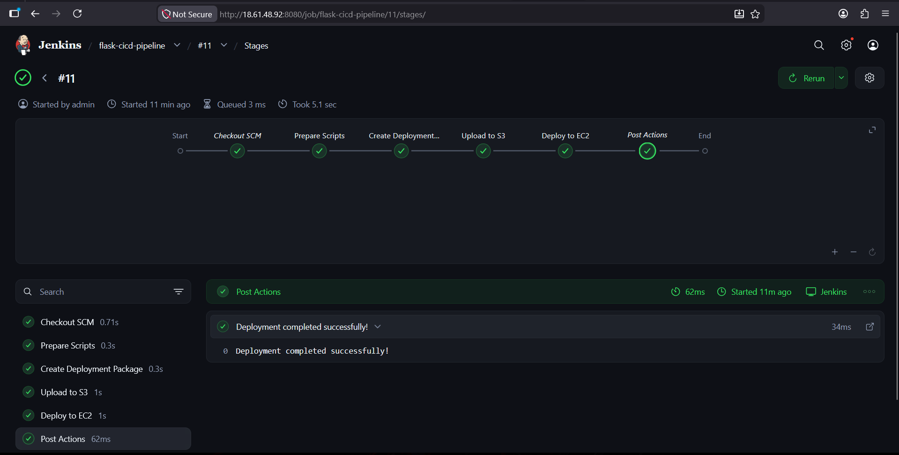
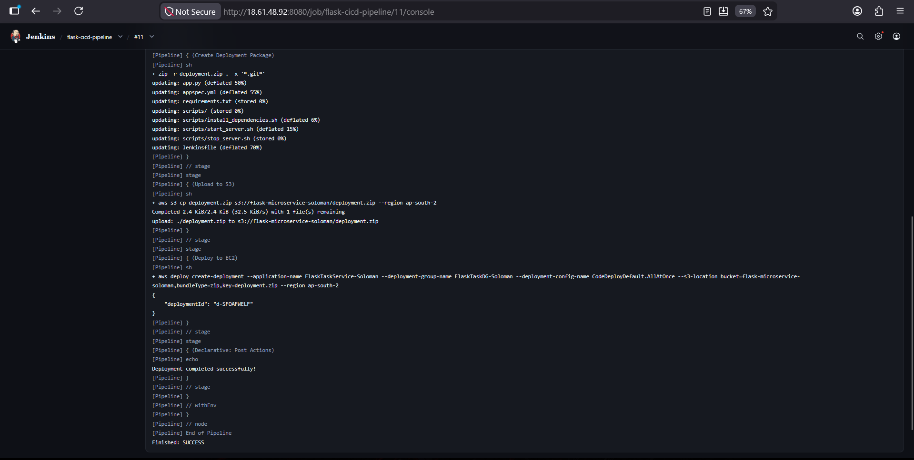
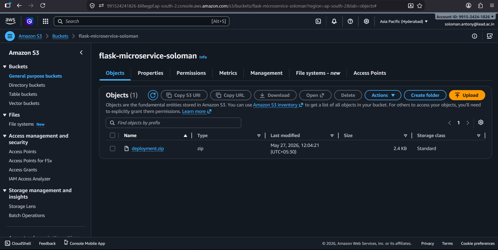
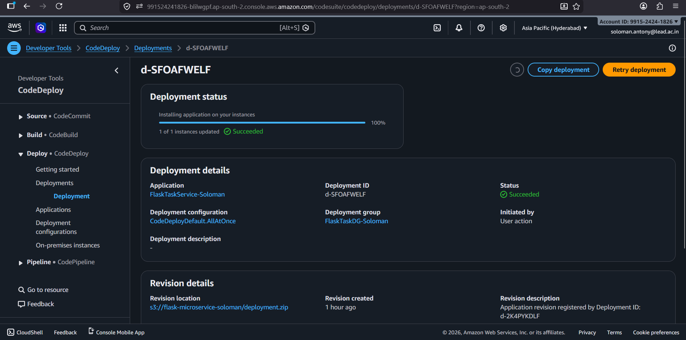
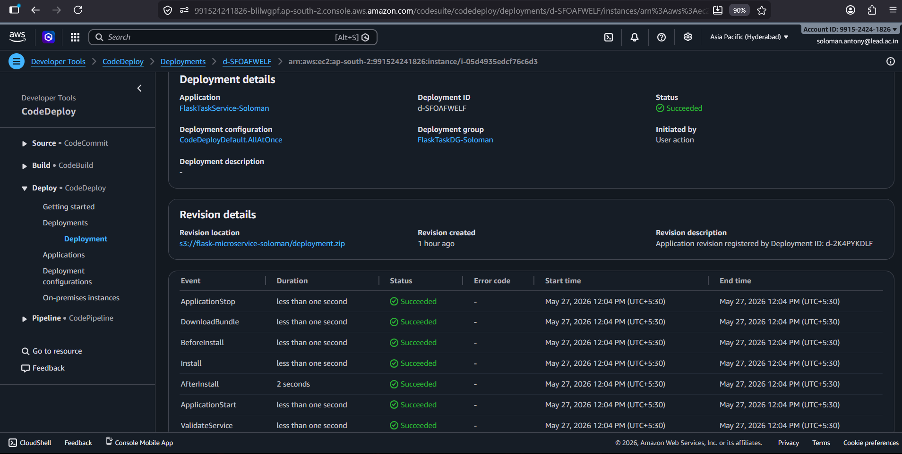
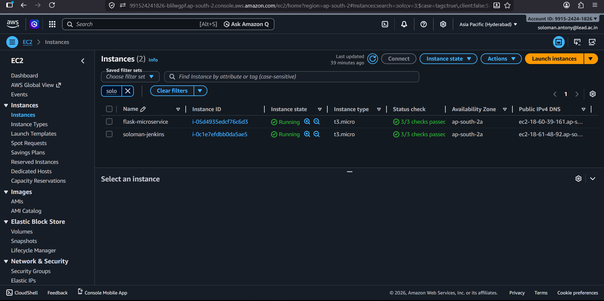
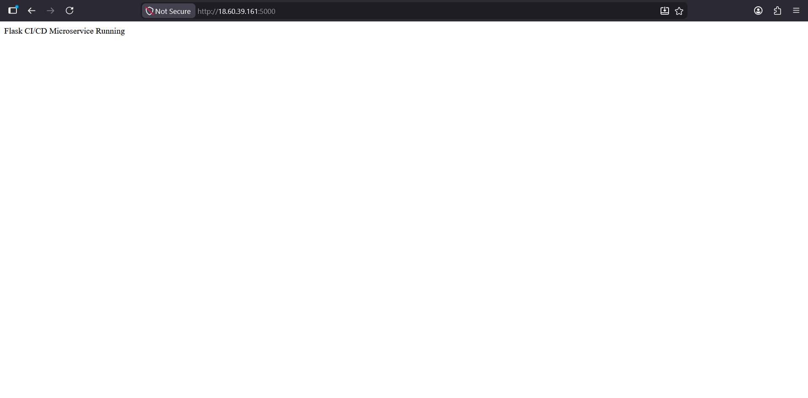
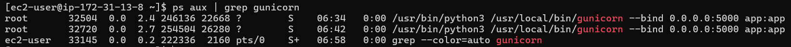
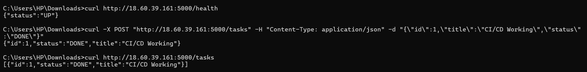

# Flask CI/CD Pipeline with Jenkins & AWS CodeDeploy

A complete CI/CD pipeline project that automates the deployment of a Python Flask microservice using Jenkins, AWS CodeDeploy, Amazon S3, and EC2.

---

# Project Architecture

```text
Developer → GitHub
             ↓
      Jenkins Server EC2
             ↓
      Build Deployment ZIP
             ↓
        Upload Artifact
             ↓
            Amazon S3
             ↓
      AWS CodeDeploy
             ↓
     Application EC2 Server
             ↓
      Flask Microservice
```

---

# Technologies Used

| Technology | Purpose |
|---|---|
| Python Flask | Backend microservice |
| Jenkins | CI/CD automation |
| AWS CodeDeploy | Automated deployment |
| Amazon S3 | Artifact storage |
| Amazon EC2 | Hosting servers |
| Gunicorn | Flask production server |
| GitHub | Source code management |
| Linux Shell Scripts | Deployment automation |

---

# Features

- Automated CI/CD pipeline
- Jenkins-based deployment workflow
- Artifact upload to Amazon S3
- Automated deployment using AWS CodeDeploy
- Flask REST API microservice
- Gunicorn production deployment
- Deployment lifecycle hooks
- Health monitoring endpoint
- Task management REST API

---

# Project Structure

```text
flask-cicd-codedeploy/
│
├── screenshots/
│   ├── codedeploy-success.png
│   ├── deployment-lifecycle-events.png
│   ├── ec2-instances.png
│   ├── flask-app-running.png
│   ├── gunicorn-process.png
│   ├── health-and-task-api-test.png
│   ├── jenkins-console-output.png
│   ├── jenkins-pipeline-success.png
│   └── s3-deployment-zip.png
│
├── scripts/
│   ├── install_dependencies.sh
│   ├── start_server.sh
│   └── stop_server.sh
│
├── app.py
├── appspec.yml
├── Jenkinsfile
├── requirements.txt
└── README.md
```

---

# Flask Microservice APIs

## Health Check

```http
GET /health
```

Response:

```json
{
  "status": "UP"
}
```

---

## Get Tasks

```http
GET /tasks
```

---

## Add Task

```http
POST /tasks
```

Request Body:

```json
{
  "id": 1,
  "title": "CI/CD Working",
  "status": "DONE"
}
```

---

# CI/CD Pipeline Flow

```text
1. Developer pushes code to GitHub
2. Jenkins pulls latest code
3. Jenkins prepares deployment scripts
4. Jenkins creates deployment ZIP
5. ZIP uploaded to Amazon S3
6. Jenkins triggers AWS CodeDeploy
7. CodeDeploy deploys application to EC2
8. Gunicorn starts Flask application
9. Application becomes publicly accessible
```

---

# AWS Infrastructure

## Jenkins Server
- Hosts Jenkins CI/CD server
- Executes deployment pipeline
- Uploads deployment artifacts to S3

## Application Server
- Runs Flask microservice
- Hosts AWS CodeDeploy agent
- Runs Gunicorn application server

---

# Deployment Lifecycle

AWS CodeDeploy uses lifecycle hooks defined in `appspec.yml`.

## BeforeInstall
Stops existing Gunicorn process.

## AfterInstall
Installs Python dependencies.

## ApplicationStart
Starts Flask application using Gunicorn.

---

# Deployment Scripts

## install_dependencies.sh

Installs Python dependencies from `requirements.txt`.

## start_server.sh

Starts Flask application using Gunicorn on port 5000.

## stop_server.sh

Stops existing Gunicorn process before deployment.

---

# Jenkins Pipeline Stages

| Stage | Description |
|---|---|
| Prepare Scripts | Adds executable permissions |
| Create Deployment Package | Creates deployment ZIP |
| Upload to S3 | Uploads artifact to S3 |
| Deploy to EC2 | Triggers CodeDeploy deployment |

---

# Screenshots

## Jenkins Pipeline Success



---

## Jenkins Console Output



---

## S3 Deployment Artifact



---

## AWS CodeDeploy Success



---

## Deployment Lifecycle Events



---

## EC2 Instances



---

## Flask Application Running



---

## Gunicorn Process



---

## Health Endpoint & Task API Test



---

# Verify Application

## Health Check

```bash
curl http://PUBLIC_IP:5000/health
```

---

## Add Task

```bash
curl -X POST http://PUBLIC_IP:5000/tasks \
-H "Content-Type: application/json" \
-d '{"id":1,"title":"CI/CD Working","status":"DONE"}'
```

---

# Author

Soloman Antony